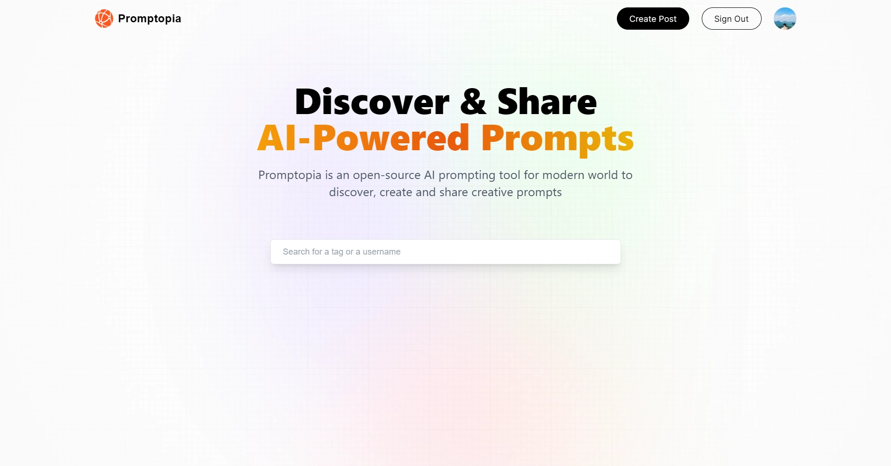

<div align="center">
    <a href="https://prompt-share-fv.vercel.app" target="_blank">
      
    </a>
  <h3 align="center">Prompt Share</h3>
</div>

##  <br /> 📋 <a name="table">Table of Contents</a>

- ✨ [Introduction](#introduction)
- ⚙️ [Tech Stack](#tech-stack)
- 📝 [Features](#features)
- 🚀 [Quick Start](#quick-start)

##  <br /> <a name="introduction">✨ Introduction</a>

**[EN]** A cutting-edge AI SaaS platform that enables users to create, discover, and enjoy podcasts with advanced features like text-to-audio conversion with multi-voice AI, podcast thumbnail Image generation and seamless playback.

**[FR]** Une plateforme SaaS d'IA de pointe qui permet aux utilisateurs de créer, découvrir et apprécier des podcasts avec des fonctionnalités avancées telles que la conversion de texte en audio avec une IA multi-voix, la génération d'images de miniature de podcast et une lecture en continu sans accroc.

##  <br /> <a name="tech-stack">⚙️ Tech Stack</a>

- **React** is a popular JavaScript library for building user interfaces, particularly single-page applications where data changes over time. React's component-based architecture allows developers to create reusable UI components, making development more efficient and the codebase easier to maintain. 

- **Next.js** is a React framework known for its server-side rendering (SSR) and static site generation (SSG) capabilities, enhancing performance and SEO for web applications. It offers features like automatic code splitting, API routes for server-side logic, and a plugin system for extensibility.

- **MongoDB** is a NoSQL database system known for its flexibility and scalability, ideal for handling large volumes of unstructured or semi-structured data. It stores data in JSON-like documents, making it easy to integrate with modern applications. MongoDB's features include powerful querying capabilities, automatic sharding for horizontal scaling, flexible data models, and support for distributed transactions in recent versions.

- **Mongoose** is an ODM (Object Data Modeling) library for MongoDB and Node.js. It simplifies interactions with MongoDB by allowing developers to define data models with strict schemas, built-in validations, database action hooks, and methods to streamline CRUD (Create, Read, Update, Delete) operations.

- **Bcrypt** is a password hashing function based on Blowfish. It is used to securely hash passwords before storing them in a database. bcrypt is known for its resistance to brute-force attacks and deliberately slow hashing process, making it suitable for securing sensitive data like user passwords.

- **NextAuth** is an authentication library for Next.js and Express.js. It simplifies integration with various authentication providers (such as Google, Facebook, GitHub) and local authentication methods. NextAuth manages user sessions and token handling securely, providing a smooth and secure authentication experience for modern web applications.

- **Tailwind** is a utility-first CSS framework that speeds up UI development by providing a set of pre-built utility classes. It allows developers to quickly build custom designs without writing traditional CSS, promoting rapid prototyping and design consistency.

## <br/> <a name="features">📝 Features</a>

👉 **Modern Design with Glassmorphism Trend Style**: A modern and visually appealing design, incorporating the glassmorphism trend style for a sleek and contemporary appearance.

👉 **Discover and Share AI Prompts**: Allow users to discover AI prompts shared by the community and create their own prompts to share with the world.

👉 **Edit and Delete Created Prompts**: Users have the ability to edit their created prompts at any time and delete them when needed.

👉 **Profile Page**: Each user gets a dedicated profile page showcasing all the prompts they've created, providing an overview of their contributions.

👉 **View Other People's Profiles**: Users can explore the profiles of other creators to view the prompts they've shared, fostering a sense of community.

👉 **Copy to Clipboard**: Implement a convenient "Copy to Clipboard" functionality for users to easily copy the AI prompts for their use.

👉 **Search Prompts by Specific Tag**: Allow users to search for prompts based on specific tags, making it easier to find prompts related to specific topics.

👉 **Google Authentication using NextAuth**: Enable secure Google authentication using NextAuth, ensuring a streamlined and trustworthy login experience.

👉 **Responsive Website**: Develop a fully responsive website to ensure optimal user experience across various devices, from desktops to smartphones.


## <br /> <a name="quick-start">🚀 Quick Start</a>

Follow these steps to set up the project locally on your machine.

<br/>**Prerequisites**

Make sure you have the following installed on your machine:

- [Git](https://git-scm.com/)
- [Node.js](https://nodejs.org/en)
- [npm](https://www.npmjs.com/) (Node Package Manager)

<br/>**Cloning the Repository**

```bash
git clone {git remote URL}
```

<br/>**Installation**

Let's install the project dependencies, from your terminal, run:

```bash
npm install
# or
yarn install
```

<br/>**Set Up Environment Variables**

Create a new file named `.env` in the root of your project and add the following content:

```env
# Google
GOOGLE_ID=
GOOGLE_CLIENT_SECRET=

# MongoDB
MONGODB_URI=

# NextAuth.js
NEXTAUTH_URL=http://localhost:3000
NEXTAUTH_URL_INTERNAL=http://localhost:3000
NEXTAUTH_SECRET=
```

Replace the placeholder values with your actual respective account credentials:

- [Google](https://console.cloud.google.com)
- [MongoDB](https://cloud.mongodb.com)
- [NextAuth](https://next-auth.js.org)


<br/>**Running the Project**

Installation will take a minute or two, but once that's done, you should be able to run the following command:

```bash
npm run dev
# or
yarn dev
```

Open [`http://localhost:3000`](http://localhost:3000) in your browser to view the project.